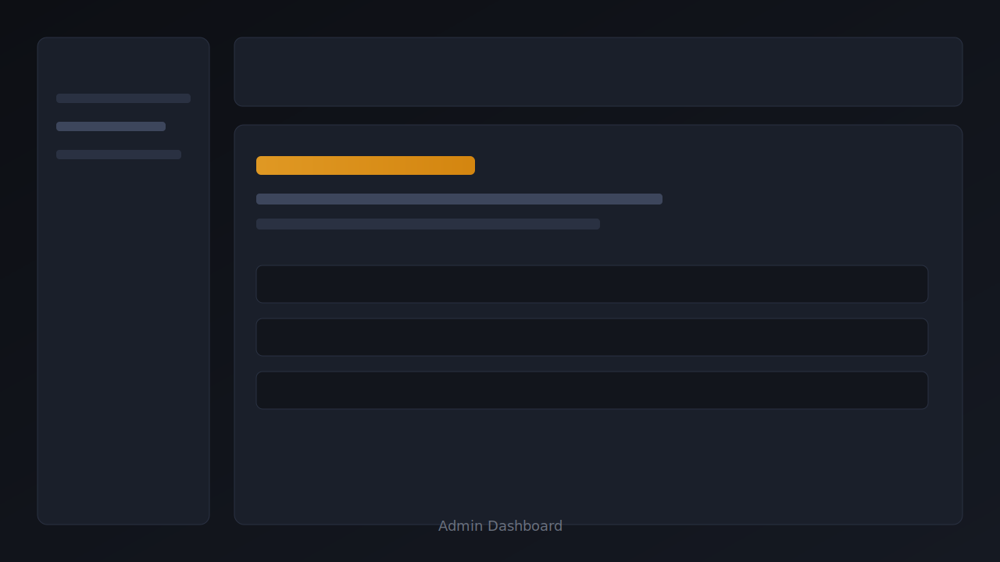
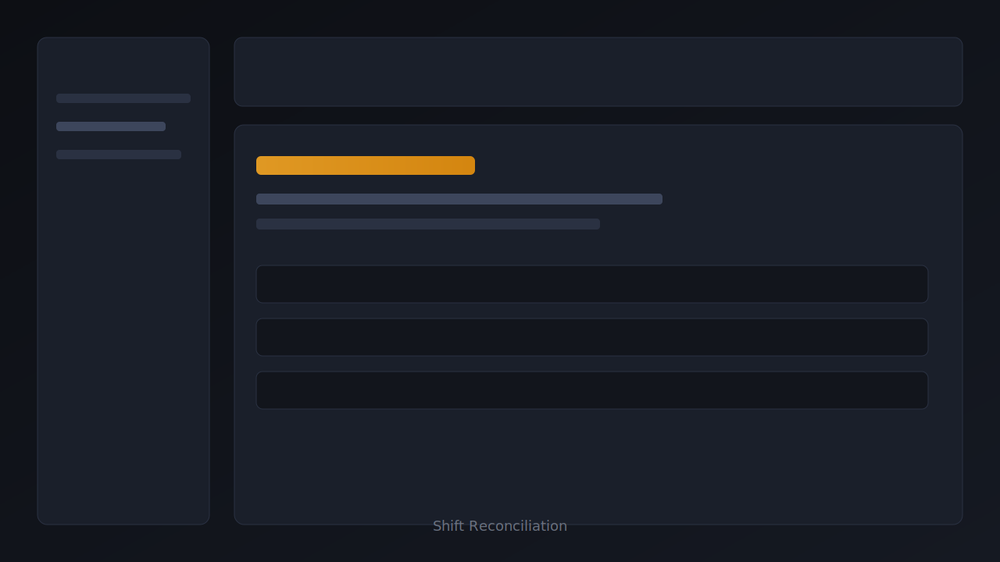
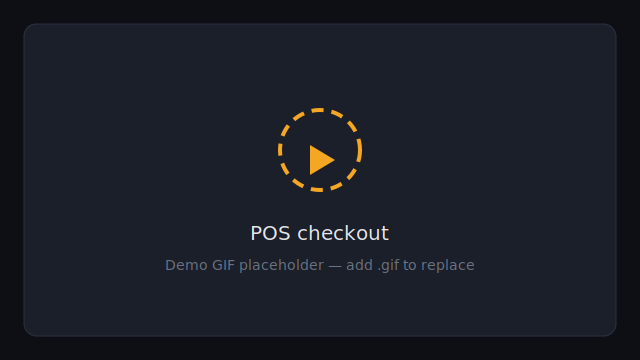
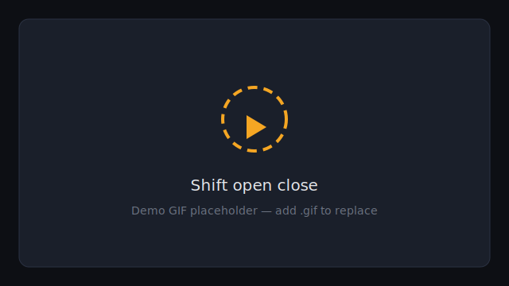
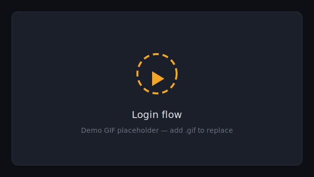
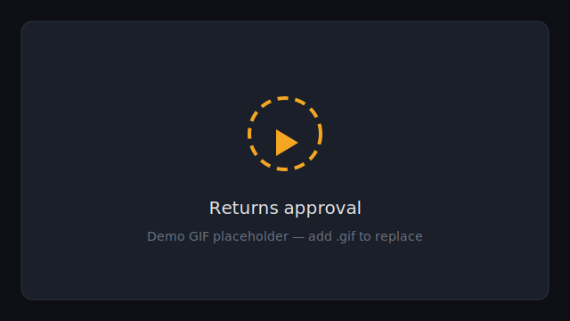

<div align="center">

# Elmahdi Supermarket ERP

**Operational retail frontend for ERPNext — POS, stock, purchasing, shifts, and returns on a single Frappe backbone.**

*React + Vite SPA · capability-based access · custom Elmahdi Frappe app · dark operational UI*

<br />

[](https://react.dev/)
[](https://vitejs.dev/)
[](https://erpnext.com/)
[](https://frappeframework.com/)
[](https://developer.mozilla.org/en-US/docs/Web/JavaScript)
[](LICENSE)
[](docs/PRODUCTION_READINESS.md)
[](package.json)
[](docs/FINAL_ACCESS_ARCHITECTURE.md)

[Overview](#overview) · [Screenshots](#screenshots) · [Architecture](#architecture) · [Features](#features) · [Setup](#setup) · [Documentation](#documentation)

</div>

---

## Overview

Supermarkets run on **tight operational loops**: sell at the register, receive goods, adjust stock, reconcile cash, and trace every document in the ledger. Generic admin panels and demo CRUD apps do not survive a Saturday rush.

**Elmahdi Supermarket ERP** is a purpose-built **React operational shell** on top of **ERPNext/Frappe**. It exposes the workflows store staff actually use—fullscreen POS, inventory workspace, procure-to-pay purchasing, shift open/close with reconciliation, and returns handling—while leaving **authoritative permissions, stock ledger, and accounting** to ERPNext.

### Why ERPNext integration matters

| Without ERP backbone | With ERPNext + Elmahdi |
|----------------------|-------------------------|
| Disconnected POS and stock | Single stock ledger; POS invoices deduct real bins |
| Permission logic only in UI | DocType permissions + SPA capability gates (defense in depth) |
| Fragile custom APIs | Standard REST + whitelisted methods on custom app |
| Audit gaps | Submitted documents, Activity Log, shift aggregates server-side |

The SPA is a **thin client**: no application server in this repo. Production safety depends on **Role Profiles**, **User Permissions**, and the custom **`elmahdi`** Frappe app for session identity and shift APIs.

### Problems this system solves

- **Cashier throughput** — barcode-ready POS, shift gating, payment split, thermal receipt
- **Stock truth** — receipts, transfers, reconciliation, ledger, alerts, reorder signals
- **Procure-to-pay** — suppliers, purchase receipts, invoices, receipt–invoice matching
- **Cash control** — POS opening/closing entries with server-side shift summaries
- **Returns discipline** — return invoices with capability-gated approval paths
- **Role separation** — cashiers, clerks, buyers, and managers land on different surfaces without sharing System Manager

---

## Screenshots

<p align="center">
  
</p>
<p align="center"><em>POS — fullscreen checkout, shift-aware, ERPNext stock sync</em></p>

<p align="center">
  
  &nbsp;&nbsp;
  
</p>

<p align="center">
  
  &nbsp;&nbsp;
  
</p>

<p align="center">
  
  &nbsp;
  
</p>

> Replace SVG previews with production PNGs in [`docs/screenshots/`](docs/screenshots/) when available (`login.png`, `pos.png`, …).

### Demo workflows

<p align="center">
  
  
</p>
<p align="center">
  
  
</p>

> Add screen recordings as `.gif` in [`docs/gifs/`](docs/gifs/) to replace preview SVGs.

---

## Architecture

### System architecture

```text
┌──────────────────────────────────────────────────────────────────────────┐
│  Browser — Elmahdi SPA (this repo)                                        │
│  React 18 · Vite 5 · React Router 6 · Axios (cookie session)              │
│  ┌────────────┐  ┌─────────────┐  ┌────────────────────────────────────┐ │
│  │  Modules   │  │  Components │  │  Auth layer (capabilities.js)     │ │
│  │  pos       │  │  layout     │  │  Role Profile → boolean caps      │ │
│  │  inventory │  │  ui         │  │  ProtectedRoute / CapabilityRoute │ │
│  │  purchasing│  │  pos/shifts │  └────────────────────────────────────┘ │
│  │  admin     │  └─────────────┘                                            │
│  │  returns   │                                                             │
│  │  shifts    │                                                             │
│  └─────┬──────┘                                                             │
│        │                                                                    │
│  ┌─────▼──────────────────────────────────────────────────────────────┐   │
│  │  Services layer                                                    │   │
│  │  api · inventoryApi/Service · purchasing* · pos* · shifts* · returns*│   │
│  │  authRoleResolution · activityLogService                          │   │
│  └─────┬──────────────────────────────────────────────────────────────┘   │
└────────┼──────────────────────────────────────────────────────────────────┘
         │  HTTPS  /api/*  (proxy in dev · same-origin recommended in prod)
         ▼
┌──────────────────────────────────────────────────────────────────────────┐
│  Frappe / ERPNext site                                                    │
│  ┌─────────────────────┐    ┌─────────────────────────────────────────┐  │
│  │  Custom app: elmahdi │    │  ERPNext core                            │  │
│  │  api/auth.py         │    │  Item · Bin · Stock Entry · Sales Inv.  │  │
│  │  api/shifts.py       │    │  Purchase Receipt/Invoice · POS Opening  │  │
│  │  get_session_identity│    │  Permissions · Workflows · GL · Stock SLE  │  │
│  └─────────────────────┘    └─────────────────────────────────────────┘  │
│                              MariaDB · Redis · Background workers          │
└──────────────────────────────────────────────────────────────────────────┘
```

### Authentication & capability flow

```text
  User submits credentials
           │
           ▼
  POST /api/method/login  (Frappe session cookie)
           │
           ▼
  authRoleResolution.loadSessionIdentity()
           │
           ├──► GET elmahdi.api.auth.get_session_identity  (preferred)
           │         roles[] + role_profile_name from server
           │
           └──► fallback: GET User doc roles (may fail for non-admin readers)
           │
           ▼
  deriveCapabilities(roles, roleProfileName)
           │
           ├── Role Profile match (Elmahdi Cashier, Purchasing Officer, …)
           └── strict ERP role fallback (Purchase User, Stock User, …)
           │
           ▼
  AuthContext exposes capabilities + legacy aliases (isAdmin, isPOS, …)
           │
           ▼
  ProtectedRoute / CapabilityRoute / nav filters
           │
           ▼
  Fail-closed: unknown persona → /login (no username inference)
```

### ERP integration pattern

```text
  Page / hook
       │
       ▼
  service function (inventoryService, purchasingService, …)
       │
       ├── GET /api/resource/{DocType}?fields=[...]&filters=[...]
       ├── POST /api/resource/{DocType}  → create draft
       └── PUT  /api/resource/{DocType}/{name}  { docstatus: 1 }  → submit
       │
       ▼
  normalizeERPError → ApiErrorCard / toast
       │
       ▼
  PartialDataBanner when secondary queries fail (purchasing dashboards)
```

### Shift workflow (operational)

```text
  Cashier: Open shift (/shifts/open)
       │  POS Opening Entry (submitted)
       ▼
  POS sales during shift (/pos)
       │  POS Invoices · payments · stock deduction
       ▼
  Cashier: Close shift (/shifts/close)
       │  Cash count form · variance banner
       ▼
  elmahdi.api.shifts.get_shift_summary (server aggregates)
       │  Sales · returns · payment mix vs opening float
       ▼
  POS Closing Entry (submitted) → shift locked
       │
       ▼
  Manager: Shift history (/shifts/history) — canViewShiftReports
```

---

## Features

### POS

| Capability | Implementation |
|------------|----------------|
| Fullscreen cashier UI | `/pos` — no admin layout constraint |
| Catalog + cart + payments | `POSPage`, `POSPaymentPanel`, `posCheckout.js` |
| Barcode scanner hook | `useBarcodeScanner.js` |
| POS Profile + warehouse stock | `posApi.js`, `posStock.js` |
| Shift bar (open/close state) | `POSShiftBar.jsx` |
| Metrics + thermal receipt | `POSMetricsBar`, `POSThermalReceipt` |
| VIEW vs OPERATE separation | `canViewPOS` / `canOperatePOS` |

### Inventory

| Capability | Route / module |
|------------|----------------|
| Overview KPIs + product table | `/inventory` |
| Stock entry (receipt/issue) | `/inventory/stock-entry` |
| Transfers | `/inventory/transfer` (`canInventoryTransfer`) |
| Reconciliation | `/inventory/reconciliation` (`canInventoryReconcile`) |
| Stock ledger | `/inventory/ledger` |
| Item details + movement timeline | `/inventory/items` |
| Low stock & reorder alerts | `/inventory/alerts`, `/inventory/reorder` |
| Batches | `/inventory/batches` |
| Analytics | `/inventory/analytics` (`canInventoryAnalytics`) |
| Reports + export | `/inventory/reports` |
| Warehouse scope | `warehouseScope.js` + ERP User Permissions |

### Purchasing

| Capability | Route |
|------------|-------|
| Purchasing dashboard + workflow bar | `/admin/purchasing` |
| Suppliers + detail | `.../suppliers`, `.../suppliers/:id` |
| Receive stock (Purchase Receipt) | `.../receive` |
| Purchase invoices | `.../invoices` |
| Receipt–invoice matching | `.../matching` |
| Purchase reports + export | `.../reports` |
| Safe PR list fields | `purchasingQueryUtils.js` (`PURCHASE_RECEIPT_LIST_FIELDS`) |
| Dedicated access (no System Manager) | `canAccessPurchasing` → `require="purchasing"` |

### Returns

| Capability | Route / guard |
|------------|----------------|
| Returns workspace | `/admin/returns` |
| View returns | `canViewReturns` |
| Create returns | `canCreateReturns` (e.g. cashier profile) |
| Approve returns | `canApproveReturns` (store manager) |
| Validation | `returnsValidation.js`, `returnsService.js` |

### Shift management

| Capability | Route / guard |
|------------|----------------|
| Open shift | `/shifts/open` · `canOpenShift` |
| Close + cash count | `/shifts/close` · `canCloseShift` |
| Shift history | `/shifts/history` · `canViewShiftReports` |
| Server-side summary | `elmahdi.api.shifts` |
| POS integration | `shiftsApi.js`, `shiftsService.js` |

### Admin

| Capability | Route / guard |
|------------|----------------|
| Operations dashboard | `/admin` · `canAccessAdminWorkspace` |
| Sales invoices | `/admin/invoices` |
| Customers | `/admin/customers` |
| Activity log | `/admin/activity` |
| ERP report portal | `/admin/reports` |
| User management | `/admin/users` · `canManageUsers` |
| Settings | `/admin/settings` · `canManageSettings` |
| Products (system) | `/admin/products` · `canManageSystem` |

### Security

| Control | Detail |
|---------|--------|
| Fail-closed auth | No username/path capability inference |
| Profile-first capabilities | `capabilityProfiles.js` beats loose ERP role heuristics |
| Route guards | `ProtectedRoute`, `CapabilityRoute`, `InventoryCapabilityRoute` |
| Nav filtering | `AdminLayout`, `InventoryLayout` hide unauthorized links |
| ERP enforcement | DocType read/write/submit remains authoritative |
| Session identity API | `elmahdi.api.auth.get_session_identity` |

### ERP integration

| Area | Pattern |
|------|---------|
| HTTP client | Axios + cookies (`withCredentials`) |
| List queries | Explicit `fields` JSON arrays |
| Submit flow | Create → `PUT` `docstatus: 1` with retry |
| Errors | `normalizeERPError`, `ApiErrorCard` |
| Desk / print / images | `erpLinks.js`, `config/erp.js` |
| Activity | `activityLogService.js` (local + optional ERP read) |

### Operational controls

| Control | Detail |
|---------|--------|
| Partial data banners | Dashboards continue when secondary ERP queries fail |
| Validation utils | `inventoryValidation`, `purchasingValidation`, `shiftValidation`, `returnsValidation` |
| Export / print | `ExportToolbar`, `exportCsv.js` on operational reports |
| Lazy-loaded routes | Code-split modules in `App.jsx` |
| Error boundaries | Admin, inventory, POS layouts |

---

## Authentication & authorization

### Fail-closed session model

1. **Login** — `POST /api/method/login` establishes a Frappe session cookie.
2. **Identity** — `authRoleResolution.js` calls **`elmahdi.api.auth.get_session_identity`** for server-side roles (avoids fragile User doc reads).
3. **Capabilities** — `deriveCapabilities()` in `src/auth/capabilities.js` maps **Role Profile + roles** → explicit booleans (`canOperatePOS`, `canAccessPurchasing`, …).
4. **Routing** — `homePathFromCapabilities()` sends each persona to one home surface.
5. **No inference** — If roles cannot be resolved, the user stays on `/login` (username guessing disabled).

### Operational personas (Role Profiles)

| Elmahdi profile | Default home | Primary surface |
|-----------------|--------------|-----------------|
| Elmahdi Cashier | `/pos` | POS + shifts |
| Elmahdi Inventory Clerk | `/inventory` | Stock operations |
| Elmahdi Purchasing Officer | `/admin/purchasing` | Procure-to-pay |
| Elmahdi Store Manager | `/admin` | Dashboard, reports, approvals |
| Administrator | `/admin` | Full workspace |

See [docs/FINAL_ACCESS_ARCHITECTURE.md](docs/FINAL_ACCESS_ARCHITECTURE.md) and [docs/ROUTE_CAPABILITY_MAP.md](docs/ROUTE_CAPABILITY_MAP.md).

### Route guards (summary)

| Path | Guard | Key capability |
|------|-------|----------------|
| `/pos` | `require="pos"` | `canViewPOS` |
| `/inventory/*` | `require="inventory"` | `canAccessInventory` |
| `/admin/purchasing/*` | `require="purchasing"` | `canAccessPurchasing` |
| `/admin/*` | `require="admin"` | `canAccessAdminWorkspace` |
| `/shifts/*` | authenticated + per-route | `canOpenShift`, `canCloseShift`, … |
| Feature routes | `CapabilityRoute` | e.g. `canManageUsers`, `canViewReturns` |

---

## Operational workflows

### POS opening → sale → closing

1. Cashier opens shift (`/shifts/open`) — **POS Opening Entry** submitted in ERP.
2. POS catalog loads items, prices, and stock for the POS Profile warehouse.
3. Checkout creates and submits **POS Invoice**; stock and payments post in ERP.
4. Cashier closes shift (`/shifts/close`) with cash count; **Elmahdi shift API** aggregates sales/returns/payment mix.
5. **POS Closing Entry** submitted; variance surfaced in UI.

### Purchasing (procure-to-pay)

1. Maintain **Supplier** master data.
2. **Receive stock** — create/submit **Purchase Receipt** (increases stock).
3. **Purchase Invoice** — supplier payable; link lines to receipts.
4. **Invoice matching** — reconcile receipts to invoices via **Purchase Invoice Item** child rows.
5. **Purchase reports** — history, cost trend, CSV/print export.

### Inventory adjustments

1. **Stock Entry** — receipt, issue, transfer (capability-gated).
2. **Stock Reconciliation** — manager-only route; ERP should enforce approval workflow.
3. **Ledger / item detail** — audit movement from Stock Ledger Entries.

### Returns & refunds

1. Authorized roles create return documents from `/admin/returns`.
2. Store managers approve when `canApproveReturns` is set on profile.
3. Stock and receivables follow ERPNext Return Invoice / credit note rules.

---

## Tech stack

| Layer | Technology |
|-------|------------|
| UI | React 18, plain CSS design tokens |
| Build | Vite 5 |
| Routing | React Router DOM 6 (lazy routes) |
| HTTP | Axios (cookie session) |
| Backend | ERPNext v15 on Frappe Framework |
| Database | MariaDB (via Frappe) |
| Custom server app | Python — `erp-custom/elmahdi` |
| Tooling | Node.js 18+ |

---

## Project structure

```text
supermarket-erp/
├── public/                 Static assets (logo, favicon)
├── src/
│   ├── auth/               Capability derivation & Role Profiles
│   │   ├── capabilities.js
│   │   ├── capabilityProfiles.js
│   │   ├── inventoryCapabilities.js
│   │   └── roleProfileResolution.js
│   ├── components/
│   │   ├── layout/         AdminLayout, InventoryLayout, ProtectedRoute, …
│   │   ├── ui/             Table, StatCard, ExportToolbar, RoleBadge, …
│   │   ├── pos/            POS-specific UI
│   │   └── inventory/      Stock tables, MovementTimeline
│   ├── config/             erp.js — ERP URL configuration
│   ├── context/            AuthContext, NotificationContext
│   ├── hooks/              useAuth, usePOS, useBarcodeScanner, …
│   ├── modules/
│   │   ├── admin/          Dashboard, customers, users, settings, …
│   │   ├── auth/           LoginPage
│   │   ├── inventory/      Stock workspace pages
│   │   ├── pos/            POSPage
│   │   ├── purchasing/     Suppliers, receive, invoices, matching
│   │   ├── returns/        ReturnsPage
│   │   └── shifts/         Open, close, history
│   ├── services/           ERP API & domain orchestration
│   ├── styles/             globals, pos, admin, layout-system, shifts
│   ├── utils/              format, validation, export, warehouse scope
│   ├── App.jsx             Route tree
│   └── main.jsx
├── docs/                   Engineering & operations documentation
│   ├── screenshots/        README gallery assets
│   ├── gifs/               Workflow demo loops
│   └── diagrams/           Optional SVG exports
├── erp-custom/
│   └── elmahdi/            Frappe app (session identity, shift APIs)
├── scripts/                ERP seed utilities
├── .env.example
├── vite.config.js          Dev /api proxy → ERPNext
└── package.json
```

### Key folders

| Path | Role |
|------|------|
| `src/services/` | All ERP HTTP; pages should not call Axios directly |
| `src/auth/` | Single source for capabilities—extend here, not in components |
| `src/modules/` | Route-level screens grouped by operational domain |
| `docs/` | Architecture, permissions, workflows, production checklists |
| `erp-custom/elmahdi/` | Install on bench; required for production session identity |

---

## Setup

### Prerequisites

- **Node.js** 18+
- **ERPNext** site (v15 recommended) with supermarket company, warehouse, POS Profile, price list
- **Frappe bench** for custom app install

### Frontend

```bash
git clone <repository-url>
cd supermarket-erp
cp .env.example .env
npm install
npm run dev
```

Open **http://localhost:5173**. Vite proxies `/api` to `VITE_ERPNEXT_URL` so session cookies work in development.

### Build

```bash
npm run build    # output: dist/
npm run preview  # local preview of production build
```

### Environment variables

| Variable | Required | Description |
|----------|:--------:|-------------|
| `VITE_ERPNEXT_URL` | Yes | ERPNext origin (desk, images, print links). Default: `http://127.0.0.1:8000` |
| `VITE_ERP_API_BASE` | No | Override REST base. Dev uses same-origin `/api` when unset |
| `VITE_ERP_PRINT_BASE` | No | Printview origin; defaults to `VITE_ERPNEXT_URL` |

Copy from [`.env.example`](.env.example).

### ERP connection (development)

1. Start ERPNext (`bench start`).
2. Add frontend origin to **Allow CORS** in System Settings if not using a reverse proxy.
3. Ensure test users have **Role Profiles** (not only System Manager).
4. Install **elmahdi** app (below) for `get_session_identity`.

---

## ERP setup (Frappe bench)

### Install custom app `elmahdi`

```bash
cd ~/frappe-bench

# Link from this monorepo
ln -sf /path/to/supermarket-erp/erp-custom/elmahdi apps/elmahdi
grep -qx elmahdi sites/apps.txt || echo elmahdi >> sites/apps.txt

./env/bin/pip install -e apps/elmahdi
bench build --app elmahdi
bench --site your-site.local install-app elmahdi
bench --site your-site.local clear-cache
```

Full instructions: [erp-custom/elmahdi/README.md](erp-custom/elmahdi/README.md).

### Verify session API

```bash
curl -s -b cookies.txt \
  "http://your-site.local:8000/api/method/elmahdi.api.auth.get_session_identity"
```

### Role Profiles & permissions

Create **Role Profiles** aligned with store operations (do not assign raw System Manager to floor staff):

| Profile | ERP roles (indicative) | SPA home |
|---------|------------------------|----------|
| Elmahdi Cashier | POS User | `/pos` |
| Elmahdi Inventory Clerk | Stock User + warehouse User Permission | `/inventory` |
| Elmahdi Purchasing Officer | Purchase User | `/admin/purchasing` |
| Elmahdi Store Manager | Custom mix | `/admin` |
| Elmahdi Administrator | System Manager (minimal count) | `/admin` |

Detailed DocType matrix: [docs/ERP_PERMISSION_ALIGNMENT.md](docs/ERP_PERMISSION_ALIGNMENT.md).

**Critical purchasing notes:**

- Grant read on **Purchase Invoice Item** for matching.
- Never add `purchase_invoice` to Purchase Receipt **list** `fields` (SPA uses `per_billed` + child join).

---

## Security notes

| Topic | Practice |
|-------|----------|
| **Authoritative permissions** | ERPNext DocType permissions enforce read/write/submit; SPA gates are additive |
| **Fail-closed** | Unresolved roles → login failure, not guessed access |
| **Profile-first** | `Elmahdi Store Manager` prevents `Sales Manager` → full POS operate leak |
| **No bypass** | Do not fetch admin-only data from purchasing routes; use capability checks |
| **Session identity** | Prefer `get_session_identity` over client-side User doc scraping |
| **Audit** | `activityLogService` + ERP Activity Log / submitted documents |
| **HTTPS** | Required in production; same-site cookie deployment preferred |

See [docs/SECURITY_GAPS.md](docs/SECURITY_GAPS.md) and [docs/REMAINING_SECURITY_GAPS.md](docs/REMAINING_SECURITY_GAPS.md) for tracked items.

---

## Production deployment

### Recommended topology

```text
                    ┌─────────────────┐
   Users ──────────►│  nginx / Caddy   │
                    │  TLS termination │
                    └────────┬────────┘
                             │
              ┌──────────────┼──────────────┐
              ▼                             ▼
      /  →  dist/ (SPA)              /api → ERPNext (Frappe)
```

1. `npm run build` with production `VITE_ERPNEXT_URL`.
2. Serve `dist/` as static files.
3. Proxy `/api` to the Frappe site (same host recommended).
4. Configure ERP **Role Profiles**, **User Permissions**, and **POS Profile** per store.
5. Smoke-test with one user per persona ([docs/PRODUCTION_READINESS.md](docs/PRODUCTION_READINESS.md)).

### Operational safeguards

- Separate **staging** and **production** companies/sites.
- Disable welcome emails for service accounts; prefer **disable user** over delete.
- Restrict System Manager count; use Elmahdi profiles day-to-day.
- Enable reconciliation / high-value PI **approval workflows** in ERP where required.

### VPS checklist (summary)

| Item | Notes |
|------|-------|
| OS | Ubuntu 22.04+ LTS |
| Bench | Frappe v15 + ERPNext |
| Process | `bench start` or supervisor in prod |
| TLS | Let’s Encrypt on reverse proxy |
| Backups | `bench backup` + off-site MariaDB |
| Monitoring | ERP error log, nginx access, disk |

---

## Roadmap

| Phase | Focus |
|-------|--------|
| **Near term** | UI layout migration completion, item detail overhaul, centralized `fmtCurrency` |
| **Analytics** | Deeper margin/GL-aligned KPIs; branch comparison |
| **Offline POS** | Queue sales when connectivity drops; replay to ERP |
| **Hardware** | Improved barcode scanner + label printer integration |
| **Warehouse** | Multi-step transfers, pick lists, delivery notes |
| **Mobile** | Responsive inventory + manager approvals |
| **Accounting** | Payment reconciliation, bank feed hooks |
| **Multi-branch** | Company/warehouse switcher, consolidated reporting |

Tracked in [docs/NEXT_STEPS.md](docs/NEXT_STEPS.md).

---

## Documentation

| Document | Purpose |
|----------|---------|
| [docs/ARCHITECTURE.md](docs/ARCHITECTURE.md) | Routing, services, data flow |
| [docs/FINAL_ACCESS_ARCHITECTURE.md](docs/FINAL_ACCESS_ARCHITECTURE.md) | Capability model |
| [docs/ROUTE_CAPABILITY_MAP.md](docs/ROUTE_CAPABILITY_MAP.md) | Route → capability table |
| [docs/ERP_RULES.md](docs/ERP_RULES.md) | REST patterns & purchasing field rules |
| [docs/ERP_PERMISSION_ALIGNMENT.md](docs/ERP_PERMISSION_ALIGNMENT.md) | ERPNext Role Profile matrix |
| [docs/PRODUCTION_READINESS.md](docs/PRODUCTION_READINESS.md) | Go-live checklist |
| [docs/SHIFT_WORKFLOW_SUMMARY.md](docs/SHIFT_WORKFLOW_SUMMARY.md) | Shift operations |
| [docs/RETURNS_ERP_FLOW.md](docs/RETURNS_ERP_FLOW.md) | Returns flow |
| [docs/PURCHASING_OPERATIONS.md](docs/PURCHASING_OPERATIONS.md) | Purchasing runbook |
| [CONTRIBUTING.md](CONTRIBUTING.md) | Contributor guide |

---

## Contributing

We welcome focused PRs that respect ERP permissions and the capability architecture. Read [CONTRIBUTING.md](CONTRIBUTING.md) before opening a pull request.

---

## License

This project is licensed under the **MIT License** — see [LICENSE](LICENSE). The `elmahdi` Frappe app includes the same license in [erp-custom/elmahdi/license.txt](erp-custom/elmahdi/license.txt).

---

<div align="center">

**Built for real supermarket operations — not demo CRUD.**

ERPNext holds the ledger. Elmahdi holds the floor.

</div>
