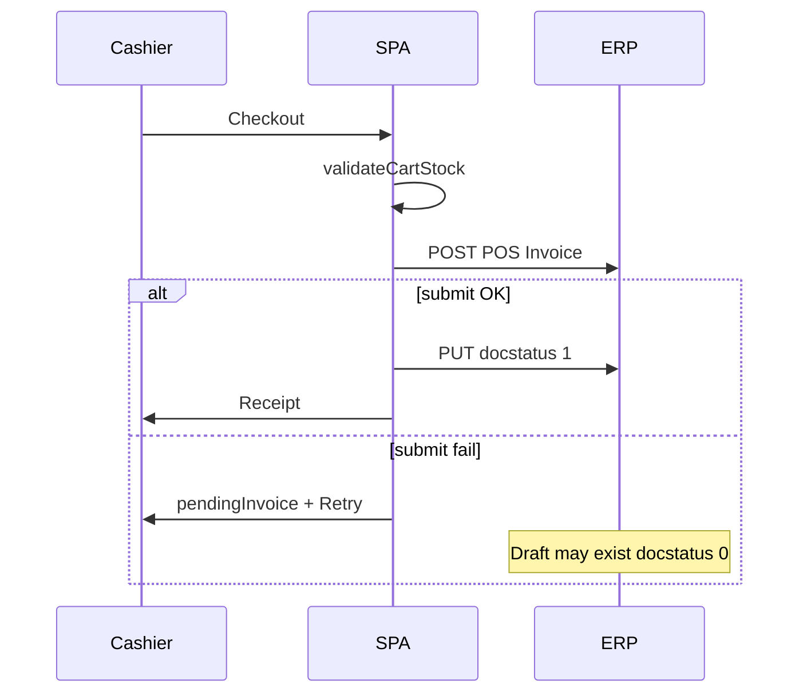

# Submit Flow Risks

**Audit date:** May 2026  
**Focus:** Duplicate submit, race conditions, retry semantics, missing confirmations, draft orphans.

---

## Standard submit pattern (reference)

```text
POST /api/resource/{DocType}     → draft (docstatus 0)
PUT  /api/resource/{DocType}/{name}  { docstatus: 1 }
GET  (optional verify docstatus === 1)
```

Implemented in: `inventoryApi.js`, `purchasingApi.js` (`submitDoc`), `posCheckout.js`.

---

## Retry configuration

| Flow | Retries | Delay | Post-fail ID |
|------|---------|-------|--------------|
| Stock Entry | 2 | 400ms | `err.draftName` |
| Purchase Receipt | 2 | 400ms | `err.draftName` |
| Purchase Invoice | 2 | 400ms | `err.draftName` |
| POS Invoice | 3 | 400–1200ms | `err.invoiceName`, `recoverable` |
| Stock Reconciliation | **0** | — | **none** |

---

## Double-submit risks

### Page-level guards (`submittingRef` / `checkoutLoading`)

| Page | Guard | Risk if double-click |
|------|-------|----------------------|
| `ReceiveStockPage` | `submittingRef` | Low |
| `PurchaseInvoicesPage` | `submittingRef` | Low |
| `StockEntryPage` | **None** | **Medium** — two drafts possible |
| `StockTransferPage` | **None** | **Medium** |
| `ReconciliationPage` | `saving` only | **Medium** — `saving` blocks UI but rapid double-fire before state update |
| `POSPage` | `checkoutLoading` | Low |

### Service-level idempotency

- **None.** Retries call `submit` again; mitigated by checking `docstatus === 1` after failure — **good** for Stock Entry, PR, PI, POS.
- **Reconciliation:** no check loop — failed submit after create leaves **orphan draft** with no user-facing name.

### Retry success after network timeout

**Scenario:** PUT submit succeeds; client times out; retry submits again.

- ERPNext typically returns error on double submit — safe.
- Recovery path reads docstatus — **safe** if GET succeeds.

**Severity:** **Low** for retried flows; **Medium** for reconciliation without recovery.

---

## Race conditions

### Bin qty read → stock issue/transfer

```text
T0  Clerk loads available qty = 10
T1  POS sells 8 units
T2  Clerk submits issue qty 10
```

- Client may pass `sourceQty` validation from stale T0.
- ERP submit may fail or allow negative stock per settings.

**Mitigation:** ERP negative stock disabled; re-fetch bin immediately before submit (not implemented).

### Cart stock check → POS checkout

- `syncCartStock` before `createPOSInvoice` — reduces gap.
- Two cashiers same item — ERP handles at invoice submit.

**Severity:** **Medium**

### Reconciliation count

- `fetchCurrentQty` on item blur; user delays submit while sales occur.
- Counted qty may not match intent.

**Mitigation:** Re-fetch all lines on submit (not implemented).

### Parallel PR + PI for same goods

- Receive via PR; create standalone PI with same items — **business process** risk, not race.

**Severity:** **High** (process + ERP config)

---

## Dangerous submit flows (ranked)

| Rank | Flow | Why |
|------|------|-----|
| 1 | Stock Reconciliation submit | Valuation + qty truth; no retry/draft UX |
| 2 | Standalone Purchase Invoice submit | Payable + possible duplicate stock |
| 3 | Material Issue without fresh bin read | Shrink / theft vector |
| 4 | Opening Stock reconciliation purpose | Historical balance corruption |
| 5 | POS dismiss pending invoice | Draft POS Invoice may exist unsubmitted |
| 6 | `retrySubmitPOSInvoice` after manual Desk submit | Usually harmless (docstatus check) |

---

## Missing confirmations

| Action | Recommended confirm |
|--------|---------------------|
| Submit reconciliation | Yes — show delta summary |
| Material Issue | Yes — qty + warehouse |
| Material Transfer | Yes — source/target |
| PR receive | Optional — line totals |
| PI submit | Yes — grand total + supplier |
| POS checkout | No (throughput) — shift + total display sufficient |
| Delete user | Has confirm |

---

## Missing validations (client)

| Area | Gap |
|------|-----|
| Reconciliation | `validateReconciliationLine` not wired |
| Reconciliation | No warning if counted qty differs large % from ERP |
| PI lines | `rate` can be 0 |
| PR/PI | No PO reference (PO not in SPA) |
| Stock entry | Single item per document — multiple items require multiple submits |
| POS | No max discount; no return qty |
| Batch items | No batch on movement lines |

---

## Incorrect ERPNext usage (SPA)

| Issue | Detail |
|-------|--------|
| PI without PR link on create | Should prefer PR → draft PI link or PI with `update_stock: 0` |
| DocType naming | Docs say Sales Invoice; code uses **POS Invoice** (`api.createPOSInvoice`) |
| Reconciliation qty | Must remain **absolute counted qty**, not delta — current UI correct |
| `linkReceiptToInvoice` | Correct use of `purchase_receipt` + `pr_detail` |
| PR list fields | Correctly avoids `purchase_invoice` on list (`purchasingQueryUtils`) |

---

## Recovery / rollback behavior

| Failure point | SPA behavior | ERP operator action |
|---------------|--------------|---------------------|
| Stock Entry submit fail | Show `draftName` | Submit or cancel draft in Desk |
| PR/PI submit fail | Show `draftName` | Submit or cancel draft |
| POS submit fail | Pending invoice UI | Retry or cancel in Desk |
| Reconciliation submit fail | Generic error only | Find draft SR in Desk manually |
| Successful submit | Success message | Cancel only via Desk (amend workflow) |

**No SPA cancel API** for any DocType.

---

## POS invoice lifecycle (detailed)



**Dismiss path:** Clears pending state in SPA; **does not** call ERP cancel — draft may remain.

---

## Related documents

- [WORKFLOW_INTEGRITY.md](./WORKFLOW_INTEGRITY.md)
- [STOCK_SAFETY_AUDIT.md](./STOCK_SAFETY_AUDIT.md)
- [ERP_TRANSACTION_GAPS.md](./ERP_TRANSACTION_GAPS.md)
